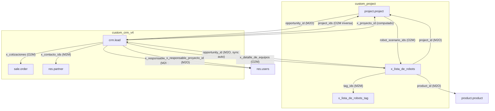
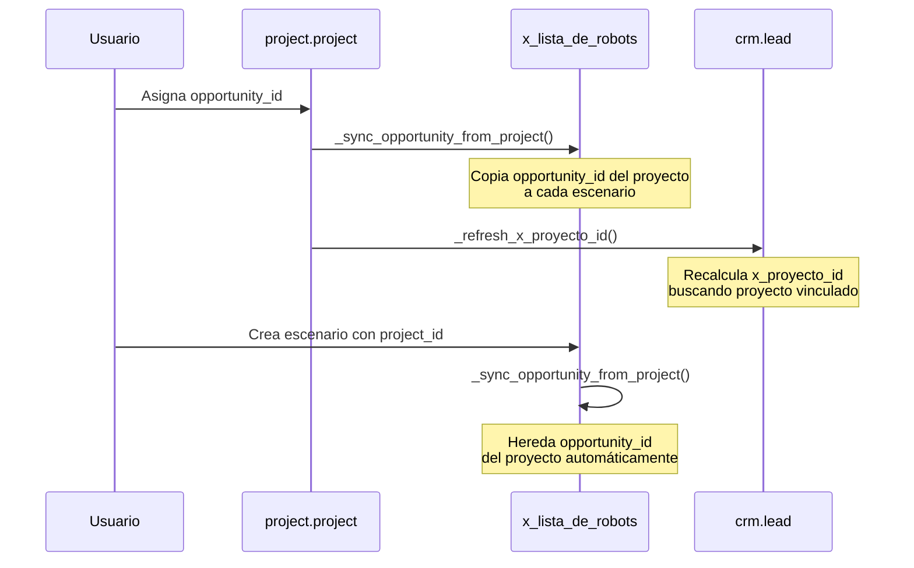

# Documentación de Módulos — Automatiza S.A.

> [!NOTE]
> Esta documentación cubre los módulos **custom_project** y **custom_crm_v4** desarrollados sobre Odoo 17.0 para Automatiza S.A.

---

## Índice

1. [Módulo custom_project](#módulo-custom_project)
2. [Módulo custom_crm_v4](#módulo-custom_crm_v4)
3. [Relación entre módulos](#relación-entre-módulos)

---

## Módulo `custom_project`

| Dato | Valor |
|---|---|
| **Nombre técnico** | `custom_project` |
| **Nombre** | Automatiza Proyecto y Lista de Robots |
| **Versión** | `17.0.2.1.0` |
| **Categoría** | Project |
| **Dependencias** | `project`, `crm`, `product` |
| **Licencia** | LGPL-3 |

### Archivos del módulo

| Archivo | Descripción |
|---|---|
| [__manifest__.py](file:///c:/odoo_project/odoo_addons/automatiza/custom_project/__manifest__.py) | Manifiesto del módulo |
| [models/project_project.py](file:///c:/odoo_project/odoo_addons/automatiza/custom_project/models/project_project.py) | Extensión de `project.project` y `crm.lead` |
| [models/lista_robots.py](file:///c:/odoo_project/odoo_addons/automatiza/custom_project/models/lista_robots.py) | Modelos `x_lista_de_robots` y `x_lista_de_robots_tag` |
| [hooks.py](file:///c:/odoo_project/odoo_addons/automatiza/custom_project/hooks.py) | Post-init hook para etapas predeterminadas |
| [views/project_project_views.xml](file:///c:/odoo_project/odoo_addons/automatiza/custom_project/views/project_project_views.xml) | Vista formulario del proyecto |
| [views/lista_robots_views.xml](file:///c:/odoo_project/odoo_addons/automatiza/custom_project/views/lista_robots_views.xml) | Vistas tree/form/search de escenarios + menú |
| [data/project_stage_data.xml](file:///c:/odoo_project/odoo_addons/automatiza/custom_project/data/project_stage_data.xml) | Etapas predeterminadas de tareas |
| [data/task_action_context.xml](file:///c:/odoo_project/odoo_addons/automatiza/custom_project/data/task_action_context.xml) | Contexto de acción de tareas (agrupar por etapa) |
| [security/ir.model.access.csv](file:///c:/odoo_project/odoo_addons/automatiza/custom_project/security/ir.model.access.csv) | Reglas de acceso |
| [static/src/js/project_kanban_open_tasks.js](file:///c:/odoo_project/odoo_addons/automatiza/custom_project/static/src/js/project_kanban_open_tasks.js) | Parche JS para abrir tareas desde kanban |

---

### 1. Campos agregados a `project.project`

Definidos en [project_project.py](file:///c:/odoo_project/odoo_addons/automatiza/custom_project/models/project_project.py#L5-L33):

| Campo | Tipo | Descripción |
|---|---|---|
| `opportunity_id` | `Many2one → crm.lead` | Oportunidad comercial vinculada al proyecto. **Restricción UNIQUE**: una oportunidad solo puede estar vinculada a un proyecto. |
| `bd_robot_code` | `Char` | Código de robot en la base de datos BD. |
| `bd_pid` | `Integer` | PID del proyecto en la base de datos BD. |
| `robot_scenario_ids` | `One2many → x_lista_de_robots` | Listado de escenarios de productos/robots asociados al proyecto (relación inversa por `project_id`). |
| `task_count` | `Integer` (computado) | Cantidad de tareas del proyecto. Calculado con `read_group` sobre `project.task`. |

#### Constraint SQL

```
opportunity_id_uniq: UNIQUE(opportunity_id)
→ "La oportunidad ya está vinculada a otro proyecto."
```

---

### 2. Campo agregado a `crm.lead` (desde custom_project)

Definido en [project_project.py](file:///c:/odoo_project/odoo_addons/automatiza/custom_project/models/project_project.py#L117-L131):

| Campo | Tipo | Descripción |
|---|---|---|
| `project_ids` | `One2many → project.project` | Proyectos vinculados a la oportunidad (relación inversa de `opportunity_id`). |

Método auxiliar [`_refresh_x_proyecto_id()`](file:///c:/odoo_project/odoo_addons/automatiza/custom_project/models/project_project.py#L126-L130): refresca el campo calculado `x_proyecto_id` del módulo CRM si existe en los campos del modelo.

---

### 3. Modelo nuevo: `x_lista_de_robots` (Escenarios de producto)

Definido en [lista_robots.py](file:///c:/odoo_project/odoo_addons/automatiza/custom_project/models/lista_robots.py#L19-L76):

| Campo | Tipo | Descripción |
|---|---|---|
| `name` | `Char` (requerido) | Nombre/referencia del escenario. Default: "Ej: Rowa 1 - Farmacia X" |
| `tag_ids` | `Many2many → x_lista_de_robots_tag` | Etiquetas del escenario |
| `project_id` | `Many2one → project.project` | Proyecto asociado (ondelete=cascade) |
| `opportunity_id` | `Many2one → crm.lead` | Oportunidad asociada (**readonly**, se sincroniza automáticamente desde el proyecto) |
| `product_id` | `Many2one → product.product` | Producto/robot seleccionado |
| `scenario` | `Integer` | Número de escenario |
| `ffq_url` | `Char` | URL del FFQ (Formulario de requerimiento) |
| `height` | `Float (16,2)` | Alto en metros |
| `length` | `Float (16,2)` | Largo en metros |
| `width` | `Float (16,2)` | Ancho en metros |
| `min_capacity` | `Integer` | Capacidad mínima |
| `max_capacity` | `Integer` | Capacidad máxima |
| `conveyor_belt` | `Float (16,2)` | Cinta de transporte en metros |
| `deflectors` | `Integer` | Cantidad de deflectores |
| `easy_load` | `Boolean` | Si tiene Easy Load |
| `easy_load_buffer` | `Float (16,2)` | Buffer del Easy Load en metros |
| `spirals` | `Integer` | Cantidad de espirales |
| `second_picking_arm` | `Boolean` | Segundo brazo de pickeo |
| `second_input_belt` | `Boolean` | Segunda cinta de ingreso |
| `refrigeration_module` | `Boolean` | Módulo de refrigeración |
| `cleaning_module` | `Boolean` | Módulo de limpieza (default: True) |
| `side_glasses` | `Integer` | Cantidad de vidrios laterales |
| `back_glass` | `Boolean` | Vidrios de fondo |
| `floor_glass` | `Boolean` | Vidrios de piso |
| `location` | `Selection` | Ubicación: Planta baja / Subsuelo / Planta alta / Entre piso / Otra |
| `other_complement` | `Text` | Complementos adicionales |
| `comments` | `Text` | Comentarios |

#### Reglas de validación de dimensiones

Definidas en [lista_robots.py](file:///c:/odoo_project/odoo_addons/automatiza/custom_project/models/lista_robots.py#L105-L198):

##### Robot BD ROWA SMART

| Parámetro | Regla |
|---|---|
| **Alto** | Debe ser exactamente 2.3, 2.5 o 2.8 metros |
| **Largo** | Entre 3.0 y 6.5 metros, en saltos de 0.5m |
| **Ancho** | Forzado a 1.63 metros (onchange) |
| **Easy Load Buffer** | Solo admite: 1, 1.5, 2, 2.5, 3 o 4 metros |

##### Robot BD ROWA VMAX

| Parámetro | Regla |
|---|---|
| **Alto** | Entre 1.70 y 3.50 metros, en saltos de 5 cm |
| **Largo (sin 2do brazo)** | Entre 3.0 y 15 metros, en saltos de 0.5m |
| **Largo (con 2do brazo)** | Entre 6.5 y 15 metros, en saltos de 0.5m |
| **Ancho** | Forzado a 1.63 metros (onchange) |
| **Easy Load Buffer** | Solo admite: 1, 1.5, 2, 2.5, 3, 4, 5, 6, 7 u 8 metros |

#### Sincronización automática de oportunidad

Método [`_sync_opportunity_from_project()`](file:///c:/odoo_project/odoo_addons/automatiza/custom_project/models/lista_robots.py#L100-L103): cuando un escenario tiene un proyecto asignado, copia automáticamente la oportunidad del proyecto al campo `opportunity_id` del escenario. Se ejecuta al crear, escribir o cambiar el proyecto.

---

### 4. Modelo nuevo: `x_lista_de_robots_tag` (Etiquetas)

Definido en [lista_robots.py](file:///c:/odoo_project/odoo_addons/automatiza/custom_project/models/lista_robots.py#L6-L16):

| Campo | Tipo | Descripción |
|---|---|---|
| `name` | `Char` (requerido, unique) | Nombre de la etiqueta |
| `color` | `Integer` | Color de la etiqueta |

---

### 5. Etapas predeterminadas de tareas

Definidas en [project_stage_data.xml](file:///c:/odoo_project/odoo_addons/automatiza/custom_project/data/project_stage_data.xml):

| Etapa | Secuencia | Plegada |
|---|---|---|
| A realizar | 10 | No |
| En proceso | 20 | No |
| Finalizadas | 30 | Sí |
| Canceladas | 40 | Sí |

> [!IMPORTANT]
> Estas etapas se asignan automáticamente a **todos los proyectos existentes** al instalar el módulo (vía `post_init_hook` en [hooks.py](file:///c:/odoo_project/odoo_addons/automatiza/custom_project/hooks.py)) y a **cada proyecto nuevo** al crearse (vía override de `create` en [project_project.py](file:///c:/odoo_project/odoo_addons/automatiza/custom_project/models/project_project.py#L51-L65)).

---

### 6. Funcionalidades adicionales

#### Botón "Tareas" en formulario de proyecto
Se agrega un botón estadístico (`oe_stat_button`) en el `button_box` del formulario de proyecto que muestra la cantidad de tareas y abre la vista kanban de tareas agrupadas por etapa.

#### Parche JavaScript — Kanban de proyectos
[project_kanban_open_tasks.js](file:///c:/odoo_project/odoo_addons/automatiza/custom_project/static/src/js/project_kanban_open_tasks.js): sobreescribe el click en tarjetas kanban de `project.project` para que al hacer click en un proyecto se abran directamente sus tareas (en vez de abrir el formulario del proyecto).

#### Contexto de acción de tareas
[task_action_context.xml](file:///c:/odoo_project/odoo_addons/automatiza/custom_project/data/task_action_context.xml): modifica la acción estándar `project.action_view_task` para que las tareas se agrupen por etapa por defecto.

#### Sección "Detalle de Equipos" en formulario de proyecto
Se agrega una sección después de la descripción del proyecto con una tabla editable de escenarios (`robot_scenario_ids`) con columnas: Escenario, ID/Referencia, Producto, Alto, Largo, Ancho, Capacidad máxima.

#### Campos visibles en formulario de proyecto
- **ID** del proyecto (readonly, antes del responsable)
- **BD Código de robot** y **BD PID** (después de etiquetas)
- **Oportunidad** (después del responsable)

---

### 7. Reglas de acceso

Definidas en [ir.model.access.csv](file:///c:/odoo_project/odoo_addons/automatiza/custom_project/security/ir.model.access.csv):

| Modelo | Grupo | Leer | Escribir | Crear | Eliminar |
|---|---|---|---|---|---|
| `x_lista_de_robots` | `base.group_user` | ✅ | ✅ | ✅ | ✅ |
| `x_lista_de_robots_tag` | `base.group_user` | ✅ | ✅ | ✅ | ✅ |

---

## Módulo `custom_crm_v4`

| Dato | Valor |
|---|---|
| **Nombre técnico** | `custom_crm_v4` |
| **Nombre** | Automatiza CRM v4 Campos Personalizados |
| **Versión** | `17.0.5.0.1` |
| **Categoría** | Sales/CRM |
| **Dependencias** | `crm`, `sale`, `sale_crm`, `project`, `custom_project` |
| **Licencia** | LGPL-3 |

### Archivos del módulo

| Archivo | Descripción |
|---|---|
| [__manifest__.py](file:///c:/odoo_project/odoo_addons/automatiza/custom_crm_v4/__manifest__.py) | Manifiesto del módulo |
| [models/crm_lead.py](file:///c:/odoo_project/odoo_addons/automatiza/custom_crm_v4/models/crm_lead.py) | Extensión de `crm.lead` con todos los campos personalizados |
| [models/res_partner.py](file:///c:/odoo_project/odoo_addons/automatiza/custom_crm_v4/models/res_partner.py) | Búsqueda de clientes por razón social |
| [models/ir_ui_view.py](file:///c:/odoo_project/odoo_addons/automatiza/custom_crm_v4/models/ir_ui_view.py) | Limpieza de vistas legacy |
| [views/crm_lead_views.xml](file:///c:/odoo_project/odoo_addons/automatiza/custom_crm_v4/views/crm_lead_views.xml) | Formulario y vistas de lista personalizadas |
| [data/cleanup_legacy_views.xml](file:///c:/odoo_project/odoo_addons/automatiza/custom_crm_v4/data/cleanup_legacy_views.xml) | Desactivación automática de vistas legacy |
| [migrations/17.0.5.0.1/post-migrate.py](file:///c:/odoo_project/odoo_addons/automatiza/custom_crm_v4/migrations/17.0.5.0.1/post-migrate.py) | Migración: refresca `x_proyecto_id` en oportunidades existentes |

---

### 1. Campos agregados a `crm.lead`

Definidos en [crm_lead.py](file:///c:/odoo_project/odoo_addons/automatiza/custom_crm_v4/models/crm_lead.py):

#### Campos de Información adicional

| Campo | Tipo | Descripción |
|---|---|---|
| `x_proyecto_id` | `Many2one → project.project` **(computado, readonly)** | Proyecto vinculado. Se calcula buscando el proyecto que tenga esta oportunidad en su `opportunity_id`. |
| `x_complejidad` | `Selection` | Complejidad: Bajo / Normal / Alto |
| `x_contacto_ids` | `Many2many → res.partner` | Contactos de la empresa, filtrados por `parent_id = partner_id` |
| `x_responsable_comercial_id` | `Many2one → res.users` | Responsable comercial asignado |
| `x_responsable_proyecto_id` | `Many2one → res.users` | Responsable de proyecto asignado |
| `x_id_cliente` | `Integer` (related) | ID del cliente, tomado de `partner_id.id` (readonly) |
| `x_canal_de_ingreso` | `Char` | Canal de ingreso de la oportunidad |

#### Campos de Cronología (fechas de seguimiento)

| Campo | Tipo | Descripción |
|---|---|---|
| `x_studio_ingreso_consulta` | `Date` | Fecha de ingreso de consulta |
| `x_studio_date_field_3vh_1jau2o5rh` | `Date` | Fecha de primer llamada |
| `x_studio_videollamada` | `Date` | Fecha de videollamada |
| `x_studio_reunin_presencial` | `Date` | Fecha de reunión presencial |
| `x_studio_envo_presentacin` | `Date` | Fecha de envío de presentación |
| `x_studio_envo_ffq` | `Date` | Fecha de envío de FFQ |
| `x_studio_cotizacin` | `Date` | Fecha de cotización |
| `x_studio_firma_cotizacin` | `Date` | Fecha de firma de cotización |
| `x_studio_acta_ec` | `Date` | Fecha de acta EC |
| `x_studio_vencimiento` | `Date` | Fecha de vencimiento |
| `x_studio_visita_de_cortesa` | `Date` | Fecha de visita de cortesía |
| `x_fecha_torta_aniversario` | `Date` | Fecha de envío de torta aniversario |
| `x_fecha_foto_aniversario` | `Date` | Fecha de foto aniversario |

> [!NOTE]
> Los campos con prefijo `x_studio_` son campos legacy migrados desde Odoo Studio. Se mantienen con ese nombre para preservar compatibilidad con datos existentes.

#### Campos de Datos de Cotización

| Campo | Tipo | Descripción |
|---|---|---|
| `x_studio_cotizacin_bd` | `Char` | Código de cotización BD |
| `x_studio_char_field_4bc_1jbo2kegr` | `Char` | URL de cotización |
| `x_studio_modelo_comercial_1` | `Selection` | Modelo comercial: Bd Argentina / Automatiza Uruguay / Otro |
| `x_studio_tipo_de_cotizacin` | `Selection` | Tipo de cotización: Robot / Refit / Otro |
| `x_studio_hardware` | `Monetary` | Valor del hardware |
| `x_studio_servicio` | `Monetary` | Valor del servicio |
| `x_studio_descuento_aplicado_` | `Float (16,2)` | Descuento aplicado (%) |
| `x_studio_total_neto` | `Monetary` | Total neto de la cotización |
| `x_studio_nmero_de_venta` | `Integer` | Número de venta |
| `x_studio_nmero_de_cliente` | `Integer` | Número de cliente |
| `x_studio_nmero_de_instalacin` | `Integer` | Número de instalación |
| `x_cantidad_robots` | `Integer` | Cantidad de robots cotizados |
| `x_detalle_de_equipos` | `One2many → x_lista_de_robots` | Detalle de equipos cotizados (vía `opportunity_id`) |
| `x_cotizaciones` | `One2many → sale.order` | Cotizaciones de venta vinculadas (vía `opportunity_id`) |
| `currency_id` | `Many2one → res.currency` | Moneda de la compañía (campo auxiliar para campos Monetary) |

#### Campos de Producto Cotizado (legacy)

| Campo | Tipo | Descripción |
|---|---|---|
| `x_studio_producto` | `Selection` | Producto: Smart / Vmax / Otro |
| `x_studio_alto` | `Float (16,2)` | Alto del producto |
| `x_studio_ancho` | `Float (16,2)` | Ancho del producto |
| `x_studio_largo` | `Float (16,2)` | Largo del producto |
| `x_studio_salidas` | `Integer` | Cantidad de salidas |
| `x_studio_capacidad_mnima_1` | `Integer` | Capacidad mínima |
| `x_studio_capacidad_mxima` | `Integer` | Capacidad máxima |
| `x_studio_cinta_de_transporte_1` | `Float (16,2)` | Cinta de transporte |
| `x_studio_easy_load_1` | `Integer` | Easy Load |
| `x_studio_espirales_1` | `Integer` | Espirales |
| `x_studio_vidrios_laterales_1` | `Integer` | Vidrios laterales |
| `x_studio_vidrios_fondo` | `Integer` | Vidrios de fondo |
| `x_studio_vidrios_piso` | `Integer` | Vidrios de piso |
| `x_studio_ubicacin` | `Selection` | Ubicación: Planta Baja / Planta Alta / Subsuelo / Entrepiso / Otra |
| `x_studio_software_gestion_text` | `Char` | Software de gestión |
| `x_studio_otro_complemento` | `Html` | Otros complementos |

> [!WARNING]
> Los campos de "Producto Cotizado" son **campos legacy** mantenidos para compatibilidad con datos anteriores. La información de productos/equipos se gestiona ahora desde el modelo `x_lista_de_robots` (Escenarios de Productos) vinculado a través de `x_detalle_de_equipos`.

---

### 2. Extensión de `res.partner`

Definida en [res_partner.py](file:///c:/odoo_project/odoo_addons/automatiza/custom_crm_v4/models/res_partner.py):

**Funcionalidad**: Permite buscar clientes por **razón social** (`company_name`) además del nombre estándar. Se activa cuando el contexto contiene `search_by_company_name: True` (usado en el formulario de oportunidades).

---

### 3. Limpieza de vistas legacy

Definida en [ir_ui_view.py](file:///c:/odoo_project/odoo_addons/automatiza/custom_crm_v4/models/ir_ui_view.py):

**Funcionalidad**: El método `action_cleanup_automatiza_crm_legacy_views()` desactiva automáticamente las vistas de formulario de `crm.lead` de módulos anteriores (`custom_crm_v3` y `modulo_crm_v3`) para evitar conflictos y pestañas duplicadas. Se ejecuta al instalar/actualizar el módulo vía [cleanup_legacy_views.xml](file:///c:/odoo_project/odoo_addons/automatiza/custom_crm_v4/data/cleanup_legacy_views.xml).

---

### 4. Vistas personalizadas del formulario de oportunidades

Definidas en [crm_lead_views.xml](file:///c:/odoo_project/odoo_addons/automatiza/custom_crm_v4/views/crm_lead_views.xml):

#### Formulario principal (hereda de `crm.crm_lead_view_form`)

Modificaciones al formulario estándar de oportunidades:

| Cambio | Descripción |
|---|---|
| **Búsqueda de cliente** | Agrega contexto `search_by_company_name: True` al campo `partner_id` |
| **Nombre de farmacia** | Renombra `partner_name` a "Nombre de la farmacia" |
| **Dirección** | Agrega bloque completo de dirección (calle, ciudad, provincia, C.P., país) después del cliente |
| **Proyecto vinculado** | Muestra `x_proyecto_id` después de las etiquetas |
| **Pestaña "Información adicional"** | Reemplaza la pestaña estándar con secciones: Información de la compañía, Contactos de la empresa, Marketing, Seguimiento |
| **Pestaña "Cronología"** | Nueva pestaña con fechas de seguimiento, post-instalación y cotización |
| **Pestaña "Configuración de Equipos"** | Nueva pestaña con: detalle de equipos (readonly, desde `x_lista_de_robots`), cotizaciones creadas (`sale.order`), datos de cotización y valores comerciales |

#### Vistas de lista adicionales

| Vista | ID XML | Descripción |
|---|---|---|
| **Vista Cotización** | `crm_lead_view_tree_cotizacion` | Oportunidad, cliente, vendedor, etapa, cotización BD, total neto, modelo comercial, tipo cotización, cantidad robots, ingreso esperado |
| **Vista Cronología** | `crm_lead_view_tree_cronologia` | Oportunidad, cliente, todas las fechas de seguimiento, etapa, probabilidad |
| **Vista Producto** | `crm_lead_view_tree_producto` | Oportunidad, cliente, cantidad robots, hardware, servicio, total neto |
| **Vista Compacta** | `crm_lead_view_tree_compacta` | Oportunidad, cliente, vendedor, etapa, probabilidad, ingreso esperado, total neto |

---

### 5. Migración

[post-migrate.py](file:///c:/odoo_project/odoo_addons/automatiza/custom_crm_v4/migrations/17.0.5.0.1/post-migrate.py): al actualizar a la versión `17.0.5.0.1`, refresca el campo computado `x_proyecto_id` en todas las oportunidades que ya tienen un proyecto vinculado.

---

## Relación entre módulos



### Flujo de sincronización Proyecto ↔ Oportunidad ↔ Escenarios



> [!TIP]
> **Resumen del flujo**: El usuario vincula una oportunidad al proyecto → los escenarios de ese proyecto heredan la oportunidad automáticamente → la oportunidad muestra el proyecto vinculado como campo computado (`x_proyecto_id`) y los escenarios como lista readonly (`x_detalle_de_equipos`).
